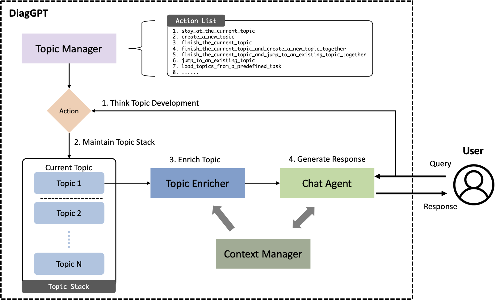

# DiagGPT

* **Dia**lo**g**ue in **Diag**nosis GPT
* Better Chatbot with Automatic Topic Management in Diverse and Complex Diagnosis Scenarios
* Code and data repo for "DiagGPT"
* Paper: "[DiagGPT: An LLM-based and Multi-agent Dialogue System with Automatic Topic Management for Flexible Task-Oriented Dialogue](https://arxiv.org/abs/2308.08043)"


## Introduction



A significant application of Large Language Models (LLMs), like ChatGPT, is their deployment as chat agents, which respond to human inquiries across a variety of domains. While current LLMs proficiently answer general questions, they often fall short in complex diagnostic scenarios such as legal, medical, or other specialized consultations. These scenarios typically require Task-Oriented Dialogue (TOD), where an AI chat agent must proactively pose questions and guide users toward specific goals or task completion. Previous fine-tuning models have underperformed in TOD and the full potential of conversational capability in current LLMs has not yet been fully explored. In this paper, we introduce DiagGPT (Dialogue in Diagnosis GPT), an innovative approach that extends LLMs to more TOD scenarios. In addition to guiding users to complete tasks, DiagGPT can effectively manage the status of all topics throughout the dialogue development. This feature enhances user experience and offers a more flexible interaction in TOD. Our experiments demonstrate that DiagGPT exhibits outstanding performance in conducting TOD with users, showing its potential for practical applications in various fields.

## Quick Start

### LLM-TOD dataset

We construct a new dataset, LLM-TOD (task-oriented dialogue for large language models dataset). It is used to evaluate the performance of LLM-based task-oriented dialogue models quantitatively. Since DiagGPT relies on LLMs, and considering our limited resources, fine-tuning LLMs for this specific purpose of TOD is not feasible. Therefore, we are unable to utilize other datasets that are tailored for fine-tuning models.

The dataset comprises 20 data, each representing a different topic: clinical, restaurant, hotel, hospital, train, police, bus, attraction, airport, bar, library, museum, park, gym, cinema, office, barbershop, bakery, zoo, and bank. Each data entry is generated by LLMs and subsequently validated by humans. For every task-oriented dialogue in the dataset, the system is required to go through a checklist in order and interact with users to achieve the specified goal. One checklist includes six items of topic or task and need to be solved or discussed. We incorporate these variables into the prompt for LLMs, thereby enabling them to execute the TOD.

### Project Structure

```shell
.
├── chatgpt                  # implementation of base chatgpt
├── data
│   └── LLM-TOD              # LLM-TOD dataset
├── demo.py                  # DiagGPT for demo test
├── diaggpt                  # simple version of DiagGPT for quantitative experiments
├── diaggpt_medical          # full version of DiagGPT in the medical consulting scenario
│   ├── embedding            # file store, retrieval, etc.
│   ├── main.py              # main code of implementation
│   ├── prompts              # all prompts in DiagGPT
│   ...
├── evalgpt                  # implementation of GPT evaluation
├── exp.py                   # code of quantitative experiments
├── exp_output               # experiment results
├── openai_api_key.txt       # openai key
├── requirements.txt         # dependencies
├── usergpt                  # simulation of the user for quantitative experiments
...
```

### Dependencies

* Python 3.10.9
* `pip install -r requirements.txt`

### Run

```shell
touch openai_api_key.txt   # put your openai api key in it

python demo.py             # demo test

python exp.py              # run quantitative experiments
```

* You need to improve any prompt or modify it to meet your needs and different base LLM.
* You can define your own predefined tasks.
* You can use vector database in Langchain to enrich model background knowledge in some fields. (Some code is already included.)


## Demo

[Here](./demo.txt) is a very simple demo of the chatbot's chat process in a medical diagnosis scenario. We simulated the process of a patient visiting a doctor. (Some patient/user input are generated by GPT-4.)

In this process, the doctor is constantly collecting information from patients and analyzing it step by step

## Limitations

At present, the existing functions of the project are very preliminary. It is only a demonstration version to show the topic management ability of LLMs, which cannot meet the needs of actual professional consultation.

The primary objective of this experiment is to demonstrate the potential of GPT-4, however, it is important to note that this is not a fully polished application or product, but rather an experimental project. It is possible that GPT-4 may not perform optimally in complex, real-world business scenarios. We encourage you to improve upon it and apply it in various scenarios, and we would be delighted to hear about your results!


## Cite us
If you find this repo useful, please cite the following paper:
```
@misc{cao2023diaggpt,
      title={DiagGPT: An LLM-based and Multi-agent Dialogue System with Automatic Topic Management for Flexible Task-Oriented Dialogue}, 
      author={Lang Cao},
      year={2023},
      eprint={2308.08043},
      archivePrefix={arXiv},
      primaryClass={cs.CL}
}
```